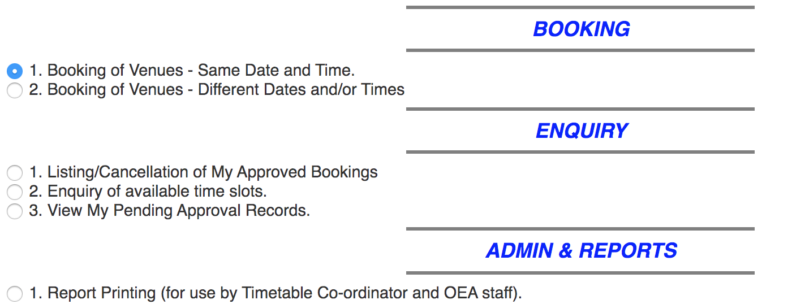
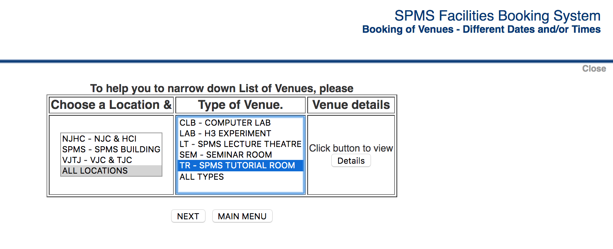
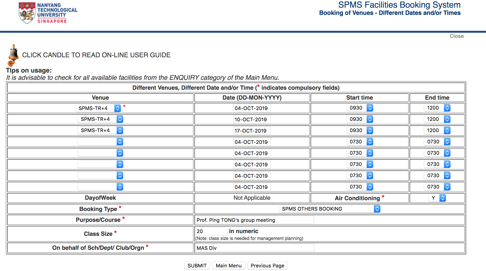

Sometimes we need to book Lecture Theatres/Tutorial Rooms/Labs, and NTU provides such a service. Let's talk about how to book a tutorial room at SPMS as an example. Follow the above stream to go into the booking system.

- ServiceNow@NTU -> Request for Services -> Campus Services -> Facilities & Booking -> Lecture Theatres/Tutorial Rooms/Labs
- Choose _**SPMS** Facilities and Experiment Booking System_ or Other

    

    - There are three sections in SPMS Facilities Booking System

        - BOOKING

            - Booking of Venues - Same Date and Time
            - Booking of Venues - Different Dates and/or Times

        - ENQUIRY

            - Listing/Cancellation of My Approved Bookings
            - Enquiry of available time slots
            - View My Pending Approval Records

        - ADMIN & REPORTS

            -  Report Printing (for use by Timetable Co-ordinator and OEA staff)
        

    - Booking procedure

        - First inquire available rooms via *Enquiry of available time slots*
        

        - Then book a room via *Booking of Venues - Different Dates and/or Times*
        

        

## Revision history

- 2019-10-03: initial draft
