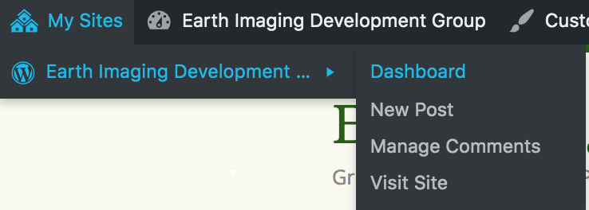
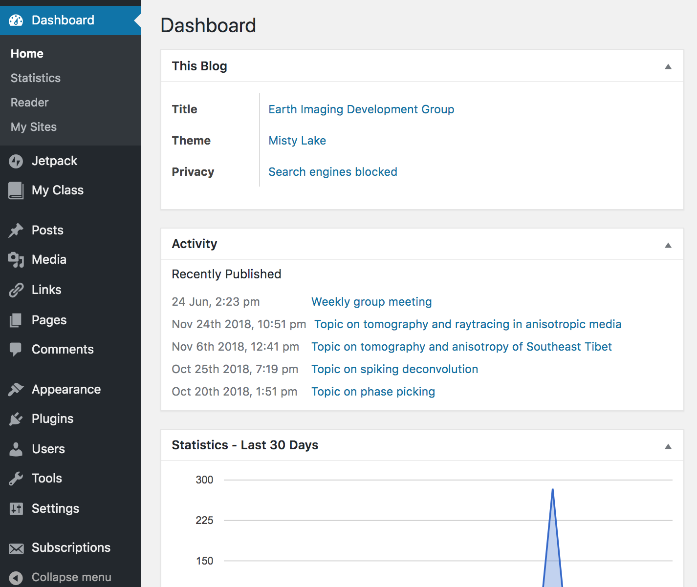
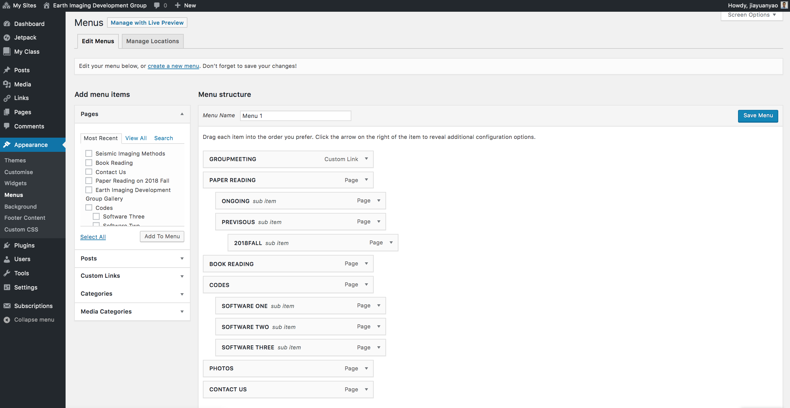
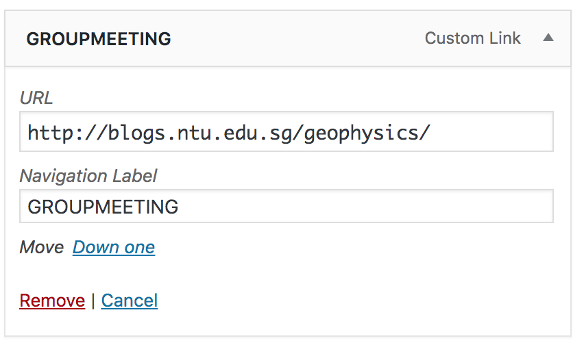
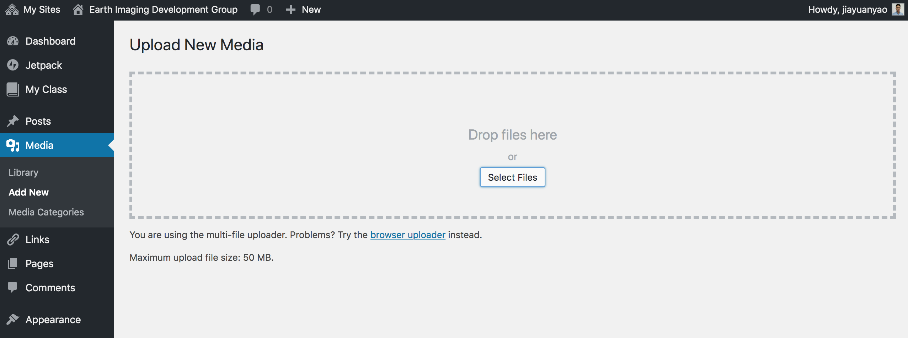
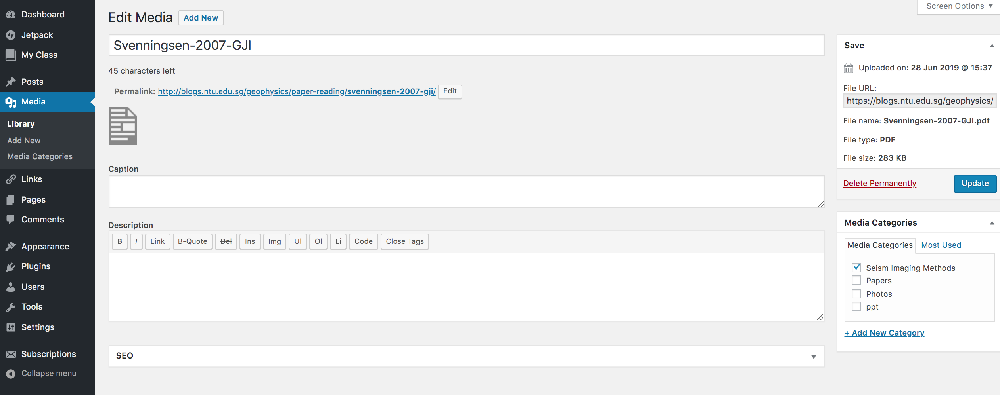
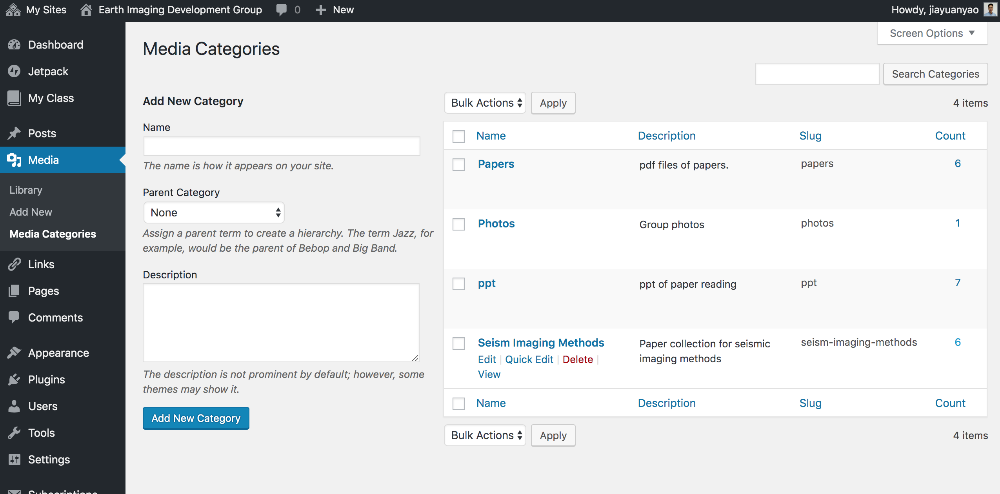
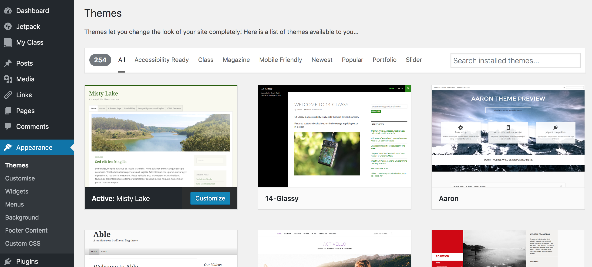
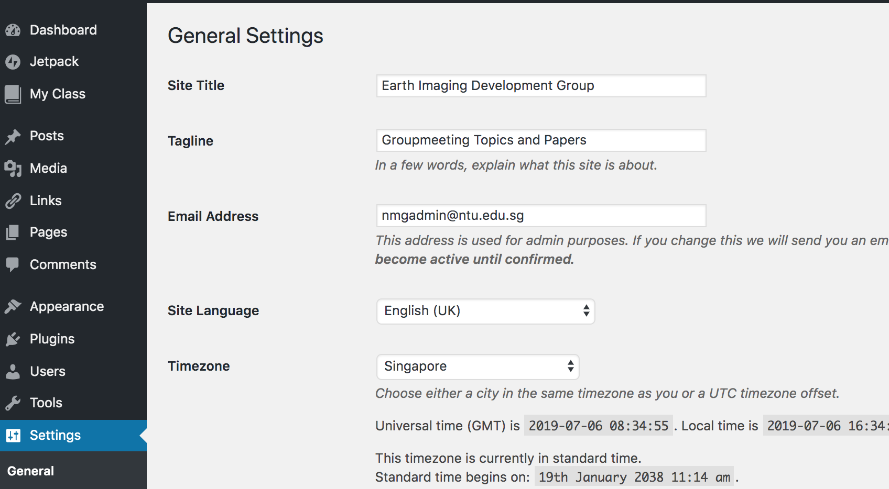

Groupmeeting Website Tutorial
=============================

:contributors: |Yao Jiayuan|
:last updating date: 2021-05-11

----

.. note::

   We now use :doc:`GitHub </group-meeting/index>` to record group meeting and
   :doc:`/data-archive/google-drive` to store ppts instead of https://blogs.ntu.edu.sg/geophysics/.
   The old group meeting website (https://blogs.ntu.edu.sg/geophysics/)
   has no longer been maintained since 2021/05/11.

我们组会网站的地址是 https://blogs.ntu.edu.sg/geophysics，
由 `blogs@NTU <https://blogs.ntu.edu.sg>`_ 提供技术支持。
``blogs@NTU`` 为 NTU 社区提供一个平台，以便整个校园能够有效地沟通交流。
网页的管理请参考 ``guide`` 。以下是我们自己在管理组会网站时候的一些具体操作和理解。

整体框架
--------

进入Dashboard:

在左栏中有很多工具: ``Posts``，``Media``，``Links``， ``Pages`` 以及 ``Appearance`` 等。

导航菜单(Navigation Menu)
+++++++++++++++++++++++++

点击进入 ``Appearance -> Menus`` ，我们可以看到网页结构 ``Menu structure`` ，有不同的菜单，比如 ``GROUPMEETING`` 、 ``PAPER READING`` 等。菜单允许嵌套，可以有子菜单和子子菜单等，比如 ``ONGING`` 、 ``PREVIOUS``、 ``2018FALL`` 。每个菜单以及嵌套的菜单其实都是 ``Pages`` 或者 ``Links`` 。

我们可以看每个菜单都有 ``Navigation Label`` ，这是网页中菜单显示的名称，而 ``URL`` 或者 ``Original`` 则是 ``Links`` 或者 ``Pages`` 的地址。

.. figure:: menu-2order.png
   :alt: menu 2order
   :width: 60.0%
   :align: center

可以选择左侧 ``Add menu items`` 中的 ``Pages`` 和 ``Custom Links`` 等，点击 ``Add to Menu`` 将选中的 ``Pages`` 或者 ``Links`` 添加到 ``Menu structure`` ，拖动可以改变每个菜单的顺序。

.. figure:: menu-add.png
   :alt: menu add
   :width: 80.0%
   :align: center

静态网页(Pages)
+++++++++++++++

编辑静态网页就像写word文件一样。网页的Title可以留空，Title会出现在静态网页的首行。网页的地址 ``Permalink`` 要简单、易记、有意义。 ``Page Arributes`` 中 ``Parent`` 可以设置此静态网页是否属于其他静态网页的子网页。点击 ``Update`` 就发表了。

.. figure:: page.png
   :alt: page
   :width: 95.0%
   :align: center

通知(Posts)
+++++++++++

通知与静态网页类似。记得给每个通知有分配一个 ``Catergories`` 和 ``Tags`` 。通知发表在主页网址 https://blogs.ntu.edu.sg/geophysics 。

.. figure:: post-1.png
   :alt: post 1
   :width: 95.0%
   :align: center

.. figure:: post-2.png
   :alt: post 2
   :width: 50.0%
   :align: center

文件(Media)
+++++++++++

可以上传文件、照片等文件到组会网站，以遍添加到静态网页、通知或者相册中。点击 ``Meida -> Add New`` 选择文件，或者直接将文件拖入。添加以后记得给每个文件分配类别 ``Categories`` ，以便管理众多文件。也可以在写 ``Pages`` 或者 ``Posts`` 的时候在文内选择 ``Add Media`` 。每个文件都有永久链接 ``Permalink`` ，也有文件网址 ``File URL`` 。永久链接的分配机制还不太清楚，貌似直接上传文件与写 ``Pages`` 或 ``Posts`` 选择添加文件，不尽相同。我们可以用文件的 ``File URL`` ，添加文件的超链接到 ``Pages`` 或者 ``Posts`` 中。

给一个pdf文件分配到类别 ``Categories`` 中的 ``Seismic Imaging Methods`` 。

点击 ``Meida -> Media Categories`` 可以看到所有的分类 ``Categories`` 。点击 ``Name`` 栏的每个分类，可以编辑每个分类。点击 ``Count`` 栏下的数字可以查看每个分类的文件，注意这里的数目好像有问题，跟每个分类实际文件数目不一致。

点击 ``ppt`` 分类后的 ``Count`` 数字，可以查看这个分类下的所有文件。

.. figure:: media-3.png
   :alt: media 3
   :width: 95.0%
   :align: center

链接(Links)
+++++++++++

可以添加一些常用网址连接，比如 ``IRIS`` ， ``Prof. Ping Tongs's website`` 等。

外观(Appearance)
++++++++++++++++

``Appearance`` 可以设置网页的主题 ``Themes`` ，添加一些小工具 ``Widgets`` 等。

**主题(Themes)**

暂时用的是 ``Misty Lake`` 主题，可以修改背景图片等。其他主题或许也可以尝试，比如Big Brother、Bhari、Cheer、Gray Chalk等。

**小工具(Widgets)**

可以在网页侧栏 ``Sidebar`` 添加一下小工具，比如 ``Search`` 、 ``Calendar`` 等。

.. figure:: widget.png
   :alt: widget
   :width: 95.0%
   :align: center

用户(Users)
-----------

点击 ``Users -> All Users`` 可以看到目前所有的用户。

.. figure:: user-2.png
   :alt: user 2
   :width: 95.0%
   :align: center

可以通过 ``Users -> Invite Users`` 添加网站的注册用户、贡献者、作者、编辑、管理员等，不同用户的权限可以查询 `oneline guide <https://blogs.ntu.edu.sg/online-guides/>`_ 。 ``blogs@NTU`` 在2019年之前建议让他们负责添加网站的管理人员，可以通过 ``contact`` 在线提交或者发邮件给 nmgadmin@ntu.edu.sg；如果我们选择自己添加网站的管理人员，被添加人员自己需要先自己注册成为blog的用户才可以。

.. figure:: user-1.png
   :alt: user 1
   :width: 95.0%
   :align: center

设置(Settings)
--------------

``Setting -> General`` 可以设置网页的 ``Title`` 、 ``Tagline`` 等基本设置。

制作相册
--------

请参考 https://docs.campuspress.com/en/articles/617-add-image-gallery

约定事项
--------

- Pages和Posts的地址要简单、有意义，比如paper-reading-2018fall (Pages)，paper-reading (Pages)，topic-on-source-encoding (Posts)，topic-on-receiver-function (Posts)等。
- Posts一定要分配Catergories和Tags，一个Posts可以多个Catergories和Tags。Catergories表示大的类别，Tags表示更具体的标签。
- 记得给上传的文件(Media)分配Categories，一个文件可以属于不同的组，比如Papers，ppt等。
- 文件和照片的命名的约定： ``FirstAuthor'sFamilyName-Year-Journal.postfix`` 或者 ``theme.postfix`` 。对于文章和ppt建议用第一种格式，如果ppt包含几篇文章，建议用第二种格式。e.g., Tromp-2005-JGR.pdf, Tromp-2005-JGR.ppt, fast-match.ppt, coda-interferometry.ppt
- 记得提前几天(通常提前一周)问报告人要干净(没有注释)的pdf、大约三句话的topic内容的summary(用于发邮件时提醒大家下次topic的大概内容)、文章的引用。文章的引用可以直接用google scholar提供的格式就好了，比如

    Cheng, C., Bodin, T., & Allen, R. M. (2016). Three-dimensional pre-stack depth migration of receiver functions with the fast marching method: a Kirchhoff approach. Geophysical Journal International, 205(2), 819-829.

- 组会后记得及时提醒报告人发ppt，以便尽早放在网上。

一些技巧
--------

在编写新的Posts或者Pages的时候，可以复制Clone已经写好的Posts或Pages，在已有的基础上进行修改，达到更快的效果。但是记得要修改标题、网页地址、categories、tags等。

如果有任何疑问可以通过 `contact <https://libfaq.ntu.edu.sg/form.php?queue_id=2609&iframe=1&qlog_id=0&pquestion=>`__
在线提交，或者发邮件给 nmgadmin@ntu.edu.sg。
